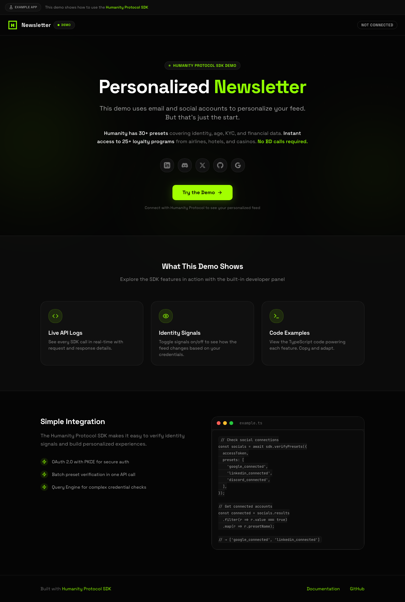

# Personalized Newsletter App

A showcase application demonstrating how to build personalized content experiences using Humanity Protocol's Connect SDK. Users authenticate with Humanity Protocol, and the app extracts their connected social accounts and verified credentials to personalize their news feed.


## Features

- 🔐 **OAuth 2.0 with PKCE** — Secure authorization flow with Humanity Protocol
- 🎯 **Identity-Based Personalization** — Feed adapts to linked social accounts and verified presets
- 📊 **Developer Console** — Split-screen panel showing real-time API logs
- 🤖 **Automated News Sync** — Vercel cron job fetches categorized content hourly
- ✈️ **Query Engine Integration** — Uses predicate queries to check hotel/airline memberships

## Demo


<details>
<summary>Screenshots</summary>

**Landing Page**


**Personalized Feed**


</details>

## How the Humanity Protocol API works

### Social Account Presets

This app uses **presets** to detect which social accounts a user has connected:

| Preset | Description |
|--------|-------------|
| `google_connected` | User has linked Google account |
| `linkedin_connected` | User has linked LinkedIn account |
| `twitter_connected` | User has linked Twitter/X account |
| `discord_connected` | User has linked Discord account |
| `github_connected` | User has linked GitHub account |
| `telegram_connected` | User has linked Telegram account |

Presets are verified using the `/presets/batch` endpoint:

```typescript
const result = await sdk.verifyPresets({
  accessToken,
  presets: ['google_connected', 'linkedin_connected', 'twitter_connected'],
});

// Response:
{
  "results": [
    { "presetName": "google_connected", "value": true },
    { "presetName": "linkedin_connected", "value": false },
    { "presetName": "twitter_connected", "value": true }
  ]
}
```

### Query Engine for Complex Conditions

The app uses the **Query Engine** to check if users have hotel or airline loyalty memberships:

```typescript
// Check for any hotel membership (Marriott, Hilton, Wyndham, etc.)
const hotelQuery = {
  policy: {
    anyOf: [
      { check: { claim: 'membership.marriott', operator: 'isDefined' } },
      { check: { claim: 'membership.hilton', operator: 'isDefined' } },
      { check: { claim: 'membership.wyndham', operator: 'isDefined' } },
      { check: { claim: 'membership.radisson', operator: 'isDefined' } },
      { check: { claim: 'membership.shangri_la', operator: 'isDefined' } },
      { check: { claim: 'membership.taj_hotels', operator: 'isDefined' } },
      { check: { claim: 'membership.mgm_resorts', operator: 'isDefined' } },
      { check: { claim: 'membership.caesars', operator: 'isDefined' } },
      { check: { claim: 'membership.wynn_resorts', operator: 'isDefined' } },
      { check: { claim: 'membership.accor', operator: 'isDefined' } },
    ],
  },
};

const result = await sdk.evaluatePredicateQuery({
  accessToken,
  query: hotelQuery,
});
// result.passed = true if user has any hotel membership
```

Users with both hotel AND airline memberships are flagged as "frequent travelers" and receive travel-related content.

**Available membership claims:**

| Category | Claims |
|----------|--------|
| Hotels | `membership.marriott`, `membership.hilton`, `membership.wyndham`, `membership.radisson`, `membership.shangri_la`, `membership.taj_hotels`, `membership.mgm_resorts`, `membership.caesars`, `membership.wynn_resorts`, `membership.accor` |
| Airlines | `membership.delta`, `membership.emirates`, `membership.american_airlines`, `membership.singapore_airlines`, `membership.cathay_pacific`, `membership.korean_air`, `membership.etihad`, `membership.virgin_australia`, `membership.thai_airways`, `membership.jetblue`, `membership.frontier_airlines`, `membership.spirit_airlines`, `membership.lufthansa`, `membership.turkish_airlines`, `membership.ryanair` |

### Content Personalization Flow

```
┌─────────────────┐     ┌──────────────────┐     ┌─────────────────┐
│  User logs in   │────▶│ Humanity Protocol │────▶│ Extract signals │
│  via OAuth      │     │   validates       │     │  (socials +     │
└─────────────────┘     └──────────────────┘     │   presets)      │
                                                  └────────┬────────┘
                                                           │
                                                           ▼
┌─────────────────┐     ┌──────────────────┐     ┌─────────────────┐
│  Personalized   │◀────│  Match content   │◀────│  Store user in  │
│     feed        │     │   to signals     │     │    MongoDB      │
└─────────────────┘     └──────────────────┘     └─────────────────┘
```

| Signal | Content Category |
|--------|------------------|
| LinkedIn connected | Professional, career, leadership |
| Discord/Telegram | Community, gaming, esports |
| Twitter/X | Trending, social, viral |
| GitHub | Tech, development, open source |
| Frequent traveler | Travel, conferences, events |

## How to run locally

### 1. Clone and navigate

```bash
git clone https://github.com/anthropics/hp-dev-api-docs
cd hp-dev-api-docs/examples/newsletter-app
```

### 2. Install dependencies

```bash
bun install
# or
npm install
```

### 3. Configure environment

Create a `.env.local` file:

| Variable | Description |
|----------|-------------|
| `HUMANITY_CLIENT_ID` | OAuth client ID from the [Developer Dashboard](https://developer.humanity.org) |
| `HUMANITY_CLIENT_SECRET` | OAuth client secret (starts with `sk_`) |
| `HUMANITY_REDIRECT_URI` | Must match exactly: `http://localhost:3100/callback` |
| `HUMANITY_BASE_URL` | API base URL: `https://api.humanity.org` |
| `MONGODB_URI` | MongoDB connection string |
| `MONGODB_DB_NAME` | Database name (e.g., `newsletter-app`) |
| `NEWS_API_KEY` | GNews API key (free tier: https://gnews.io) |
| `NEWS_API_BASE_URL` | GNews API URL: `https://gnews.io/api/v4` |
| `APP_JWT_SECRET` | Random 32+ character secret for your app's JWT |
| `APP_JWT_ISSUER` | Issuer name for your JWT (e.g., `newsletter-app`) |

```env
# Humanity Protocol
HUMANITY_CLIENT_ID=your_client_id
HUMANITY_CLIENT_SECRET=sk_your_client_secret
HUMANITY_REDIRECT_URI=http://localhost:3100/callback
HUMANITY_BASE_URL=https://api.humanity.org

# MongoDB
MONGODB_URI=mongodb://localhost:27017
MONGODB_DB_NAME=newsletter-app

# News API (GNews.io)
NEWS_API_KEY=your_gnews_api_key
NEWS_API_BASE_URL=https://gnews.io/api/v4

# Application JWT
APP_JWT_SECRET=your_super_secret_jwt_key_at_least_32_chars
APP_JWT_ISSUER=newsletter-app
APP_JWT_EXPIRES_IN=86400

# Optional: Cron secret for production
CRON_SECRET=your_cron_secret
```

### 4. Run the development server

```bash
bun dev
# or
npm run dev
```

Open [http://localhost:3100](http://localhost:3100) in your browser.

## Project structure

```
src/
├── app/
│   ├── api/
│   │   ├── auth/
│   │   │   ├── login/route.ts      # Initiates OAuth flow
│   │   │   ├── logout/route.ts     # Clears session
│   │   │   └── session/route.ts    # Returns current session
│   │   ├── feed/route.ts           # Personalized feed endpoint
│   │   ├── cron/
│   │   │   └── fetch-news/route.ts # Hourly news fetch job
│   │   └── dev/
│   │       └── logs/route.ts       # API logs for dev panel
│   ├── callback/route.ts           # OAuth callback handler
│   ├── feed/
│   │   ├── page.tsx                # Feed page
│   │   └── FeedContent.tsx         # Feed content component
│   └── page.tsx                    # Landing page
├── components/
│   ├── DevPanel.tsx                # Split-screen API console
│   ├── NewsCard.tsx                # Article card
│   ├── Header.tsx                  # Navigation header
│   └── ui/                         # shadcn components
└── lib/
    ├── auth-service.ts             # User data extraction + JWT issuance
    ├── database.ts                 # MongoDB operations
    ├── humanity-sdk.ts             # SDK singleton
    ├── news-service.ts             # GNews API integration
    └── session.ts                  # Cookie session management
```

## API endpoints

### Authentication

| Endpoint | Method | Description |
|----------|--------|-------------|
| `/api/auth/login` | POST | Initiates OAuth flow, returns authorization URL |
| `/api/auth/logout` | POST | Clears session cookies |
| `/api/auth/session` | GET | Returns current session info |
| `/callback` | GET | OAuth callback, exchanges code for tokens |

### Feed

| Endpoint | Method | Description |
|----------|--------|-------------|
| `/api/feed` | GET | Returns personalized news feed |
| `/api/dev/logs` | GET | Returns API call history for dev panel |

### Cron

| Endpoint | Method | Description |
|----------|--------|-------------|
| `/api/cron/fetch-news` | GET | Fetches news from GNews (hourly) |

## SDK usage

### Initialize the SDK

```typescript
import { HumanitySDK } from '@humanity-org/connect-sdk';

const sdk = new HumanitySDK({
  clientId: process.env.HUMANITY_CLIENT_ID,
  clientSecret: process.env.HUMANITY_CLIENT_SECRET,
  redirectUri: process.env.HUMANITY_REDIRECT_URI,
  baseUrl: process.env.HUMANITY_BASE_URL,
});
```

### Build authorization URL

```typescript
const { url, codeVerifier, state, nonce } = sdk.buildAuthUrl({
  scopes: ['openid', 'profile.full', 'data.read', 'identity:read'],
});

// Store codeVerifier, state, nonce in session
// Redirect user to url
```

### Exchange code for tokens

```typescript
const tokens = await sdk.exchangeCodeForToken({
  code,
  codeVerifier: session.codeVerifier,
});
// tokens.accessToken, tokens.refreshToken, tokens.idToken
```

### Verify social account presets

```typescript
const result = await sdk.verifyPresets({
  accessToken: tokens.accessToken,
  presets: [
    'google_connected',
    'linkedin_connected',
    'twitter_connected',
    'discord_connected',
    'github_connected',
  ],
});

for (const preset of result.results) {
  console.log(`${preset.presetName}: ${preset.value}`);
}
```

### Evaluate predicate queries

```typescript
const result = await sdk.evaluatePredicateQuery({
  accessToken,
  query: {
    policy: {
      anyOf: [
        { check: { claim: 'membership.marriott', operator: 'isDefined' } },
        { check: { claim: 'membership.hilton', operator: 'isDefined' } },
      ],
    },
  },
});

if (result.passed) {
  // User has a hotel membership
}
```

## Deployment

### Vercel

```bash
npm i -g vercel
vercel
```

The `vercel.json` configures an hourly cron job to fetch news:

```json
{
  "crons": [{
    "path": "/api/cron/fetch-news",
    "schedule": "0 * * * *"
  }]
}
```

Set environment variables in the Vercel dashboard.

### Manual news fetch

```bash
curl http://localhost:3100/api/cron/fetch-news
```

## Scripts

| Command | Description |
|---------|-------------|
| `bun dev` | Start Next.js locally on port 3100 |
| `bun build` | Production build |
| `bun start` | Start the production server |
| `bun lint` | Run ESLint |

## Get support

- [Humanity Protocol Documentation](https://docs.humanity.org)
- [Connect SDK Reference](https://docs.humanity.org/sdk)
- [Next.js Documentation](https://nextjs.org/docs)

## Other Examples

| Example | Description | Complexity |
|---------|-------------|------------|
| [next-oauth](../next-oauth) | Basic OAuth 2.0 + PKCE flow | ⭐ |
| [next-backend-auth](../next-backend-auth) | Issue your own JWTs from verified identity | ⭐⭐ |
| **You are here** | Preset-based personalization with MongoDB | ⭐⭐⭐ |

---

## Troubleshooting

### Redirect URI Mismatch

**Error:** `redirect_uri_mismatch` or "Invalid redirect URI"

**Cause:** The redirect URI in your code doesn't exactly match what's registered in the Humanity Protocol dashboard.

**Fix:**
1. Go to [Developer Dashboard](https://developer.humanity.org) → Applications → Your App
2. Check the registered redirect URIs
3. Ensure `HUMANITY_REDIRECT_URI` in `.env` matches exactly
4. For local dev, register: `http://localhost:3100/callback`

Common mistakes:
- ❌ `http://localhost:3100/callback/` (trailing slash)
- ❌ `https://localhost:3100/callback` (https vs http)
- ✅ `http://localhost:3100/callback`

---

### CORS Errors

**Error:** "Access to fetch blocked by CORS policy"

**Cause:** Browser blocking cross-origin requests to the token endpoint.

**Fix:** Token exchange must happen server-side, not in the browser. In this example, the exchange happens in `app/callback/route.ts`.

---

### Token Exchange Failing

**Error:** `invalid_grant` or "Code expired"

**Cause:** Authorization codes are single-use and expire quickly (~60 seconds).

**Fix:**
- Don't refresh the callback page (it tries to reuse the code)
- Ensure `code_verifier` matches the original `code_challenge`
- Check that you're not calling the token endpoint twice

---

### "Invalid nonce" Error

**Error:** Nonce verification failed

**Cause:** The nonce in the ID token doesn't match the nonce stored in your session.

**Fix:**
1. Ensure the nonce is stored in session/cookie **before** redirecting to authorize
2. Retrieve the **same** nonce value in the callback
3. Check that cookies are being set properly

---

### State Mismatch

**Error:** "Invalid state" or state verification failed

**Cause:** The state parameter returned from authorization doesn't match what was stored.

**Fix:**
1. Ensure state is stored in session **before** redirect
2. Same session must be available in callback

---

### MongoDB Connection Failed

**Error:** "MongoServerError" or connection timeout

**Cause:** MongoDB not running or connection string incorrect.

**Fix:**
1. Ensure MongoDB is running locally: `mongod` or `brew services start mongodb-community`
2. Check `MONGODB_URI` format: `mongodb://localhost:27017`
3. Verify `MONGODB_DB_NAME` is set
4. For MongoDB Atlas, whitelist your IP address

---

### News Feed Empty

**Error:** No articles appearing in feed

**Cause:** GNews API not configured or rate limited.

**Fix:**
1. Verify `NEWS_API_KEY` is set in `.env`
2. Check GNews API quota (free tier: 100 requests/day)
3. Manually trigger news fetch: `curl http://localhost:3100/api/cron/fetch-news`
4. Check MongoDB for existing articles: `db.articles.find()`

---

### Social Presets Not Detected

**Error:** Social account connections returning `false`

**Cause:** User hasn't linked accounts, or presets not enabled.

**Fix:**
1. User must link social accounts in their Humanity Protocol profile
2. Enable social presets in your application settings:
   - `google_connected`
   - `linkedin_connected`
   - `twitter_connected`
   - `discord_connected`
   - `github_connected`
3. Check the dev panel logs for raw API responses

---

### Query Engine Returns Unexpected Results

**Error:** Hotel/airline membership checks failing

**Cause:** User doesn't have memberships, or query syntax incorrect.

**Fix:**
1. Verify user has linked loyalty accounts in Humanity Protocol
2. Check query syntax matches the documented format
3. Use `isDefined` operator (not `equals true`)
4. Review the dev panel for raw query responses

---

## License

MIT
