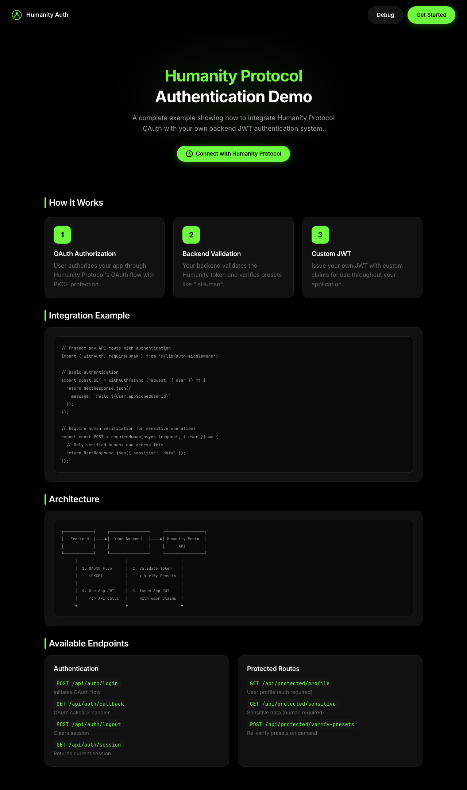
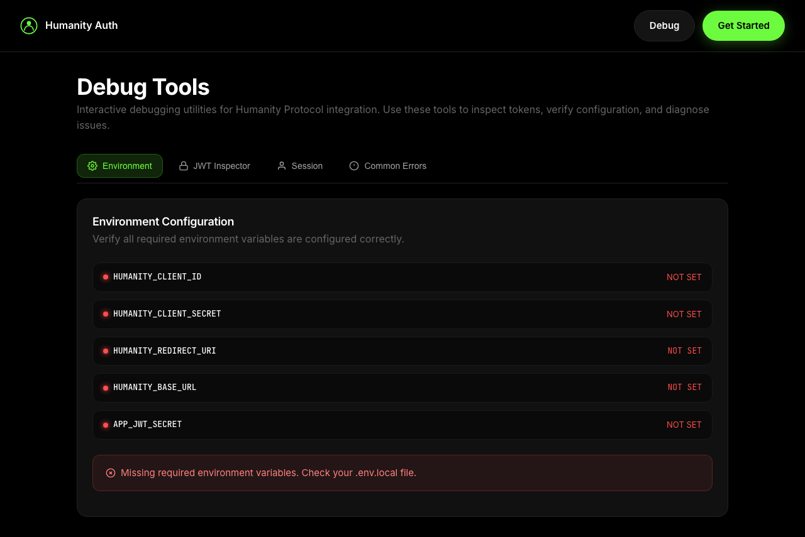

# Backend Auth with Custom JWT

A complete example showing how to integrate Humanity Protocol OAuth with your own backend JWT authentication system. This is the recommended pattern for production applications.


## Features

- 🔐 **OAuth 2.0 with PKCE** — Secure authorization flow
- ✅ **Backend Token Validation** — Verify Humanity tokens server-side
- 🧪 **Preset Verification** — Check `isHuman` and other presets
- 🎫 **Custom JWT Issuance** — Issue your own tokens with custom claims
- 🛡️ **Protected API Routes** — Middleware for authentication
- 👤 **Human-Only Routes** — Routes that require human verification
- 🔧 **Built-in Debug Page** — Interactive debugging tools

## Demo


<details>
<summary>Screenshots</summary>

**Landing Page**


**Debug Tools**


</details>

## How the Humanity Protocol API works

### The Two-Token Architecture

This example demonstrates the **recommended production pattern**: using Humanity Protocol for authentication, then issuing your own application JWTs:

```
┌───────────────────────────────────────────────────────────────────────┐
│                         Token Flow                                     │
├───────────────────────────────────────────────────────────────────────┤
│                                                                        │
│   1. User authenticates with Humanity Protocol                         │
│      ┌──────────┐      OAuth/PKCE      ┌──────────────────┐           │
│      │   User   │ ──────────────────▶  │ Humanity Protocol │           │
│      └──────────┘                      └──────────────────┘           │
│            │                                    │                      │
│            │                                    ▼                      │
│            │                           humanity_access_token           │
│            │                           humanity_id_token               │
│            │                                    │                      │
│   2. Your backend validates and issues app JWT │                      │
│            │                                    ▼                      │
│            │         ┌──────────────────────────────────┐             │
│            │         │        Your Backend              │             │
│            │         │  • Validate humanity tokens      │             │
│            │         │  • Verify presets (isHuman)      │             │
│            │         │  • Issue your app JWT            │             │
│            │         └──────────────────────────────────┘             │
│            │                          │                               │
│   3. App JWT used for all future requests                             │
│            │                          ▼                               │
│            │◀─────────────── your_app_jwt ───────────────▶            │
│            │         (contains humanity claims + your claims)         │
│                                                                        │
└───────────────────────────────────────────────────────────────────────┘
```

**Why issue your own JWTs?**

1. **Custom Claims** — Add roles, permissions, subscription tiers
2. **Control Expiration** — Set your own token lifetime
3. **Reduce API Calls** — Embed verified presets in your JWT
4. **Decouple Auth** — Your API doesn't depend on Humanity's availability

### OAuth 2.0 with PKCE

PKCE (Proof Key for Code Exchange) prevents authorization code interception attacks:

```typescript
// 1. Generate PKCE values
const codeVerifier = generateCodeVerifier();  // Random 43-128 char string
const codeChallenge = sha256(codeVerifier);   // SHA-256 hash, base64url encoded

// 2. Include challenge in authorization URL
const authUrl = `${baseUrl}/oauth/authorize?
  client_id=${clientId}&
  code_challenge=${codeChallenge}&
  code_challenge_method=S256&
  redirect_uri=${redirectUri}&
  response_type=code&
  scope=openid profile.full isHuman&
  state=${state}&
  nonce=${nonce}`;

// 3. Exchange code with verifier (proves you initiated the request)
const tokens = await sdk.exchangeCodeForToken(code, codeVerifier);
```

### Presets and Verification

**Presets** are verified user attributes. Call `/presets/verify` with an access token:

```typescript
const result = await sdk.verifyPresets(['isHuman', 'ageOver18'], accessToken);

// Response structure:
{
  "results": [
    {
      "preset": "isHuman",
      "value": true,
      "verified_at": "2024-01-15T10:30:00Z",
      "expires_at": "2025-01-15T10:30:00Z"
    },
    {
      "preset": "ageOver18",
      "value": true,
      "verified_at": "2024-01-15T10:30:00Z"
    }
  ]
}
```

### App-Scoped User ID

Each user gets a unique, stable ID scoped to your application:

```typescript
const tokens = await sdk.exchangeCodeForToken(code, codeVerifier);

// tokens.appScopedUserId = "hu_app_abc123xyz"
// This ID is:
// - Unique per user per application
// - Stable across sessions
// - Different from their global Humanity ID
```

Use this ID to identify users in your database.

## How it works

```
┌─────────────┐     ┌─────────────────┐     ┌─────────────────┐
│   Frontend  │────▶│  Your Backend   │────▶│ Humanity Proto  │
│             │     │                 │     │      API        │
└─────────────┘     └─────────────────┘     └─────────────────┘
      │                     │                       │
      │  1. OAuth Flow      │  2. Validate Token    │
      │     (PKCE)          │     + Verify Presets  │
      │                     │                       │
      │  4. Use App JWT     │  3. Issue App JWT     │
      │     for API calls   │     with user claims  │
      ▼                     ▼                       ▼
```

## How to run locally

### 1. Clone and configure the sample

```bash
git clone https://github.com/humanity-org/hp-dev-api-docs
cd hp-dev-api-docs/examples/next-backend-auth
```

### 2. Install dependencies

```bash
bun install
# or
npm install
```

### 3. Configure environment

Copy the example environment file and edit it:

```bash
cp .env.example .env.local
```

| Variable | Description |
|----------|-------------|
| `HUMANITY_CLIENT_ID` | OAuth client ID from the [Developer Dashboard](https://developer.humanity.org) |
| `HUMANITY_CLIENT_SECRET` | OAuth client secret (starts with `sk_`) |
| `HUMANITY_REDIRECT_URI` | Must match exactly: `http://localhost:3001/callback` |
| `HUMANITY_BASE_URL` | API base URL: `https://api.humanity.org` |
| `APP_JWT_SECRET` | Random 32+ character secret for your app's JWT |
| `APP_JWT_ISSUER` | Issuer name for your JWT (e.g., `my-app`) |
| `APP_JWT_EXPIRES_IN` | Token expiration in seconds (e.g., `3600`) |

```env
# Humanity Protocol
HUMANITY_CLIENT_ID=your_client_id
HUMANITY_CLIENT_SECRET=sk_your_client_secret
HUMANITY_REDIRECT_URI=http://localhost:3001/callback
HUMANITY_BASE_URL=https://api.humanity.org

# Your Application's JWT
APP_JWT_SECRET=your_super_secret_jwt_key_at_least_32_chars
APP_JWT_ISSUER=my-awesome-app
APP_JWT_EXPIRES_IN=3600
```

### 4. Run the development server

```bash
bun dev
```

Open [http://localhost:3001](http://localhost:3001) in your browser.

## Project structure

```
src/
├── app/
│   ├── api/
│   │   ├── auth/
│   │   │   ├── login/route.ts      # Initiates OAuth flow
│   │   │   ├── logout/route.ts     # Clears session
│   │   │   └── session/route.ts    # Returns current session
│   │   └── protected/
│   │       ├── profile/route.ts    # Auth required
│   │       ├── sensitive/route.ts  # Human verification required
│   │       └── verify-presets/route.ts
│   ├── callback/route.ts           # OAuth callback handler
│   ├── dashboard/page.tsx          # Protected dashboard
│   ├── debug/page.tsx              # Debug tools
│   └── page.tsx                    # Landing page
├── components/
│   ├── ApiTester.tsx               # Interactive API tester
│   ├── DebugPanel.tsx              # Debug panel
│   └── LoginButton.tsx             # OAuth login button
└── lib/
    ├── auth-middleware.ts          # Route protection utilities
    ├── auth-service.ts             # Core authentication logic
    ├── humanity-sdk.ts             # SDK singleton
    └── session.ts                  # Cookie session management
```

## API endpoints

### Authentication

| Endpoint | Method | Description |
|----------|--------|-------------|
| `/api/auth/login` | POST | Initiates OAuth flow, returns authorization URL |
| `/callback` | GET | OAuth callback, exchanges code for tokens |
| `/api/auth/logout` | POST | Clears session cookies |
| `/api/auth/session` | GET | Returns current session info |

### Protected routes

| Endpoint | Method | Auth Level | Description |
|----------|--------|------------|-------------|
| `/api/protected/profile` | GET | Authenticated | Returns user profile |
| `/api/protected/sensitive` | GET/POST | Human Verified | Sensitive operations |
| `/api/protected/verify-presets` | POST | Authenticated | Re-verify presets |

## SDK usage

### Initialize the SDK

```typescript
import { HumanitySDK } from '@humanity-org/connect-sdk';

const sdk = new HumanitySDK({
  clientId: process.env.HUMANITY_CLIENT_ID,
  clientSecret: process.env.HUMANITY_CLIENT_SECRET,  // Required for backend
  redirectUri: process.env.HUMANITY_REDIRECT_URI,
  baseUrl: process.env.HUMANITY_BASE_URL,
});
```

### Build authorization URL with PKCE

```typescript
const { url, codeVerifier, state, nonce } = sdk.buildAuthUrl({
  scopes: ['openid', 'profile.full', 'isHuman'],
});

// Store in session (required for callback)
session.codeVerifier = codeVerifier;
session.state = state;
session.nonce = nonce;

// Redirect user
redirect(url);
```

### Handle OAuth callback

```typescript
// 1. Verify state matches
if (callbackState !== session.state) {
  throw new Error('State mismatch');
}

// 2. Exchange code for tokens
const tokens = await sdk.exchangeCodeForToken(code, session.codeVerifier);

// 3. Verify nonce in ID token
if (tokens.idToken.nonce !== session.nonce) {
  throw new Error('Nonce mismatch');
}

// 4. Verify presets
const presets = await sdk.verifyPresets(['isHuman'], tokens.accessToken);

// 5. Issue your app JWT
const appJwt = jwt.sign({
  sub: tokens.appScopedUserId,
  isHuman: presets.results.find(r => r.preset === 'isHuman')?.value,
  // Add your custom claims
}, APP_JWT_SECRET);
```

### Get user profile

```typescript
const profile = await sdk.getUserInfo(accessToken);

// Returns:
{
  "sub": "hu_app_abc123",
  "email": "user@example.com",
  "email_verified": true,
  "name": "John Doe",
  "picture": "https://...",
  "humanity_id": "hu_global_xyz789"
}
```

## Usage examples

### Protecting API routes

```typescript
import { withAuth, requireHuman, requirePresets } from '@/lib/auth-middleware';

// Basic authentication
export const GET = withAuth(async (request, { user }) => {
  return NextResponse.json({ message: `Hello ${user.appScopedUserId}` });
});

// Require human verification
export const POST = requireHuman(async (request, { user }) => {
  // Only verified humans can access this
  return NextResponse.json({ sensitive: 'data' });
});

// Require specific presets
export const PUT = requirePresets(['isHuman', 'ageOver18'], async (request, { user }) => {
  // User must have both presets verified
  return NextResponse.json({ adult: 'content' });
});
```

### Server-to-server token

Get a token for a user who has already authorized your app:

```typescript
import { getHumanitySdk } from '@/lib/humanity-sdk';
import { getConfig } from '@/lib/config';

const sdk = getHumanitySdk();
const config = getConfig();

// Get a token for a specific user
const userToken = await sdk.getClientUserToken({
  clientSecret: config.humanity.clientSecret,
  email: 'user@example.com',
});

// Use the token to verify presets
const presets = await sdk.verifyPresets(
  ['isHuman'],
  userToken.accessToken,
);
```

### Custom JWT claims

Add your own claims when issuing tokens:

```typescript
const appToken = await authService.issueAppToken(user, {
  role: 'admin',
  permissions: ['read', 'write'],
  tier: 'premium',
});
```

## Debugging

### Interactive debug page

This example includes a built-in debug page at `/debug` that provides:

- **Environment Checker** — Verify all required environment variables are configured
- **JWT Inspector** — Decode and inspect any JWT token's header, payload, and expiration
- **Session Viewer** — Inspect the current authentication session
- **Error Reference** — Quick lookup for common OAuth errors and solutions

Access it at [http://localhost:3001/debug](http://localhost:3001/debug) when running locally.

### Enable SDK request logging

```typescript
import { HumanitySDK } from '@humanity-org/connect-sdk';

const debugFetch: typeof fetch = async (input, init) => {
  console.log('[SDK Request]', init?.method ?? 'GET', input);
  const response = await fetch(input, init);
  console.log('[SDK Response]', response.status);
  return response;
};

const sdk = new HumanitySDK({
  clientId: config.humanity.clientId,
  redirectUri: config.humanity.redirectUri,
  baseUrl: config.humanity.baseUrl,
  fetch: debugFetch,
});
```

## Common issues

### Redirect URI mismatch

The redirect URI must match **exactly** what's registered in the Developer Dashboard:
- ✅ `http://localhost:3001/callback`
- ❌ `http://localhost:3001/callback/` (trailing slash)
- ❌ `https://localhost:3001/callback` (wrong protocol)

### Token expired errors

Check your server clock is synchronized. Tokens use `iat` and `exp` claims.

### State/nonce verification failures

Ensure cookies are being set properly. Check browser settings and `SameSite` cookie attributes.

## Get support

- [Humanity Protocol Documentation](https://docs.humanity.org)
- [OAuth 2.0 with PKCE](https://oauth.net/2/pkce/)
- [Next.js Documentation](https://nextjs.org/docs)

## Other Examples

| Example | Description | Complexity |
|---------|-------------|------------|
| [next-oauth](../next-oauth) | Basic OAuth 2.0 + PKCE flow | ⭐ |
| **You are here** | Issue your own JWTs from verified identity | ⭐⭐ |
| [newsletter-app](../newsletter-app) | Preset-based personalization with MongoDB | ⭐⭐⭐ |

---

## Troubleshooting

### Redirect URI Mismatch

**Error:** `redirect_uri_mismatch` or "Invalid redirect URI"

**Cause:** The redirect URI in your code doesn't exactly match what's registered in the Humanity Protocol dashboard.

**Fix:**
1. Go to [Developer Dashboard](https://developer.humanity.org) → Applications → Your App
2. Check the registered redirect URIs
3. Ensure `HUMANITY_REDIRECT_URI` in `.env` matches exactly
4. For local dev, register: `http://localhost:3001/callback`

Common mistakes:
- ❌ `http://localhost:3001/callback/` (trailing slash)
- ❌ `https://localhost:3001/callback` (https vs http)
- ✅ `http://localhost:3001/callback`

---

### CORS Errors

**Error:** "Access to fetch blocked by CORS policy"

**Cause:** Browser blocking cross-origin requests to the token endpoint.

**Fix:** Token exchange must happen server-side, not in the browser. In this example, the exchange happens in `app/callback/route.ts`.

---

### Token Exchange Failing

**Error:** `invalid_grant` or "Code expired"

**Cause:** Authorization codes are single-use and expire quickly (~60 seconds).

**Fix:**
- Don't refresh the callback page (it tries to reuse the code)
- Ensure `code_verifier` matches the original `code_challenge`
- Check that you're not calling the token endpoint twice
- Verify your system clock is synchronized

---

### "Invalid nonce" Error

**Error:** Nonce verification failed

**Cause:** The nonce in the ID token doesn't match the nonce stored in your session.

**Fix:**
1. Ensure the nonce is stored in session/cookie **before** redirecting to authorize
2. Retrieve the **same** nonce value in the callback
3. Check that cookies are being set properly

---

### State Mismatch

**Error:** "Invalid state" or state verification failed

**Cause:** The state parameter returned from authorization doesn't match what was stored.

**Fix:**
1. Ensure state is stored in session **before** redirect
2. Same session must be available in callback
3. Check for cookie/session issues

---

### App JWT Verification Failing

**Error:** "Invalid signature" or "Token expired" on your app's JWT

**Cause:** Issues with your application's JWT configuration.

**Fix:**
1. Ensure `APP_JWT_SECRET` is at least 32 characters
2. Check that the same secret is used for signing and verification
3. Verify `APP_JWT_EXPIRES_IN` is set correctly (in seconds)
4. Check server clock synchronization

---

### Preset Verification Returning False

**Error:** Preset check returns `false` when expected `true`

**Cause:** User hasn't completed verification, or preset not enabled for your app.

**Fix:**
1. Ensure the preset is enabled in your application settings
2. Verify the user has completed the verification process
3. Check that you're using the correct access token (not expired)
4. Use the debug page at `/debug` to inspect the raw response

---

## License

MIT
