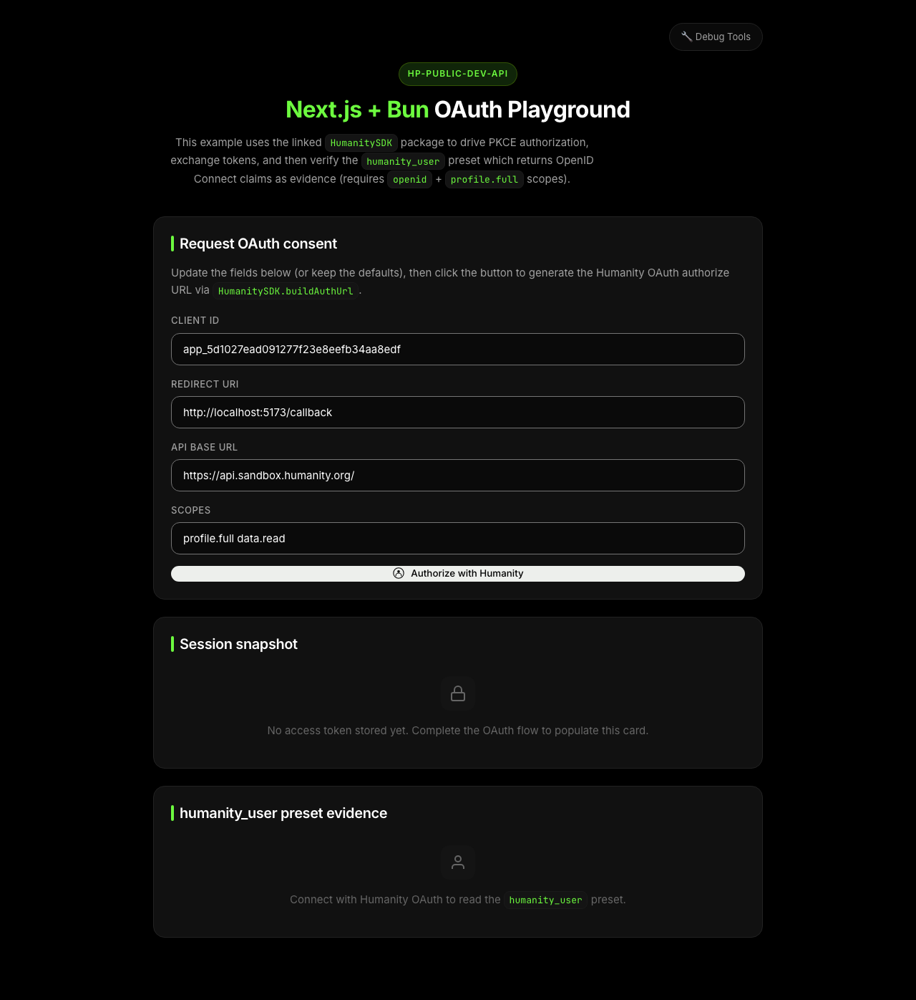
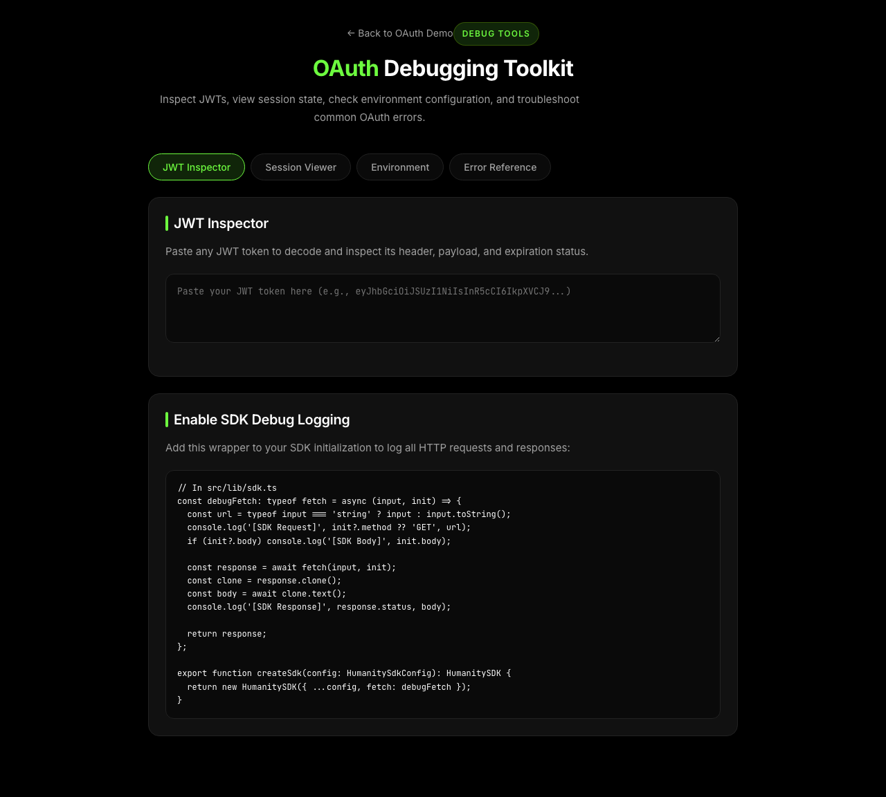

# OAuth Integration Example

Learn how to integrate Humanity Protocol OAuth into a Next.js application. This example walks through the complete PKCE authorization flow, token exchange, and profile retrieval.


## Features

- 🔐 **PKCE Authorization Flow** — Secure OAuth 2.0 with code challenge
- 🎫 **Token Exchange** — Exchange authorization code for access + refresh + ID tokens
- 🔑 **Nonce Verification** — ID token validation with nonce
- 👤 **Profile Retrieval** — Fetch user info from `/userinfo` endpoint
- 🔄 **Token Refresh** — Automatically refresh expired access tokens
- 🧪 **Interactive Demo** — Configure scopes and test the flow in real-time

## Demo


<details>
<summary>Screenshots</summary>

**Landing Page**


**Debug Tools**


</details>

## How the Humanity Protocol OAuth API works

### OAuth 2.0 with PKCE

Humanity Protocol implements OAuth 2.0 with **PKCE (Proof Key for Code Exchange)**, the recommended flow for public and confidential clients. PKCE prevents authorization code interception attacks.

```
┌──────────────────────────────────────────────────────────────────────────┐
│                        OAuth 2.0 + PKCE Flow                             │
├──────────────────────────────────────────────────────────────────────────┤
│                                                                          │
│  ┌────────┐                                           ┌────────────────┐ │
│  │  Your  │                                           │   Humanity     │ │
│  │  App   │                                           │   Protocol     │ │
│  └────┬───┘                                           └───────┬────────┘ │
│       │                                                       │          │
│       │  1. Generate code_verifier (random string)            │          │
│       │     Generate code_challenge = sha256(code_verifier)   │          │
│       │                                                       │          │
│       │  2. Redirect to /authorize                            │          │
│       │     ?code_challenge=xxx                               │          │
│       │     &code_challenge_method=S256                       │          │
│       │─────────────────────────────────────────────────────▶ │          │
│       │                                                       │          │
│       │                                      User logs in and │          │
│       │                                      approves scopes  │          │
│       │                                                       │          │
│       │  3. Redirect back with ?code=yyy                      │          │
│       │◀───────────────────────────────────────────────────── │          │
│       │                                                       │          │
│       │  4. POST /token                                       │          │
│       │     code=yyy                                          │          │
│       │     code_verifier=xxx  (proves you started the flow)  │          │
│       │─────────────────────────────────────────────────────▶ │          │
│       │                                                       │          │
│       │  5. Receive tokens                                    │          │
│       │     { access_token, refresh_token, id_token }         │          │
│       │◀───────────────────────────────────────────────────── │          │
│       │                                                       │          │
└───────┴───────────────────────────────────────────────────────┴──────────┘
```

### Authorization URL Parameters

| Parameter | Required | Description |
|-----------|----------|-------------|
| `client_id` | ✅ | Your application's client ID |
| `redirect_uri` | ✅ | Where to redirect after authorization |
| `response_type` | ✅ | Always `code` for authorization code flow |
| `scope` | ✅ | Space-separated list of requested scopes |
| `code_challenge` | ✅ | SHA-256 hash of code_verifier, base64url encoded |
| `code_challenge_method` | ✅ | Always `S256` |
| `state` | ✅ | Random string to prevent CSRF attacks |
| `nonce` | ✅ | Random string embedded in ID token |

### Token Response

When you exchange the authorization code, you receive:

```json
{
  "access_token": "eyJhbGciOiJSUzI1NiIs...",
  "token_type": "Bearer",
  "expires_in": 3600,
  "refresh_token": "dGhpcyBpcyBhIHJlZnJlc2g...",
  "id_token": "eyJhbGciOiJSUzI1NiIs...",
  "scope": "openid profile.full data.read"
}
```

| Token | Purpose | Lifetime |
|-------|---------|----------|
| `access_token` | Authenticate API requests | ~1 hour |
| `refresh_token` | Get new access tokens without re-auth | ~30 days |
| `id_token` | JWT containing user identity claims | Same as access token |

### ID Token Claims

The ID token is a JWT containing identity information:

```json
{
  "iss": "https://api.humanity.org",
  "sub": "hu_app_abc123",
  "aud": "your_client_id",
  "exp": 1704110400,
  "iat": 1704106800,
  "nonce": "your_random_nonce",
  "email": "user@example.com",
  "email_verified": true,
  "name": "John Doe"
}
```

Always verify:
1. `iss` matches Humanity Protocol's issuer
2. `aud` matches your client ID
3. `nonce` matches what you sent in the authorization request
4. `exp` is in the future

### Scopes

Scopes control what data your app can access:

| Scope | Description |
|-------|-------------|
| `openid` | Required for OpenID Connect. Returns `sub` claim. |
| `profile.full` | Full profile: name, picture, email, etc. |
| `profile.basic` | Basic profile: name and picture only |
| `data.read` | Read user's credential data |
| `isHuman` | Access to verify `isHuman` preset |
| `ageOver18` | Access to verify `ageOver18` preset |

### UserInfo Endpoint

After obtaining an access token, fetch user profile data:

```typescript
const profile = await sdk.getUserInfo(accessToken);

// Response:
{
  "sub": "hu_app_abc123xyz",
  "email": "user@example.com",
  "email_verified": true,
  "name": "John Doe",
  "picture": "https://cdn.humanity.org/avatars/abc123.jpg",
  "humanity_id": "hu_global_xyz789",
  "wallet_address": "0x1234...abcd"
}
```

### Token Refresh

Access tokens expire after ~1 hour. Use the refresh token to get new ones:

```typescript
const newTokens = await sdk.refreshAccessToken(refreshToken);
// newTokens.accessToken, newTokens.refreshToken
```

## How to run locally

### 1. Clone and configure the sample

```bash
git clone https://github.com/humanity-org/hp-dev-api-docs
cd hp-dev-api-docs/examples/next-oauth
```

### 2. Install dependencies

```bash
bun install
# or
npm install
```

### 3. Configure environment

Create a `.env.local` file:

| Variable | Description |
|----------|-------------|
| `HUMANITY_CLIENT_ID` | OAuth client ID from the [Developer Dashboard](https://developer.humanity.org) |
| `HUMANITY_REDIRECT_URI` | Must match exactly: `http://localhost:5173/oauth/callback` |
| `HUMANITY_ENVIRONMENT` | Environment: `sandbox` or `production` |

```env
HUMANITY_CLIENT_ID=your_client_id
HUMANITY_REDIRECT_URI=http://localhost:5173/oauth/callback
HUMANITY_ENVIRONMENT=sandbox
```

### 4. Run the development server

```bash
bun dev
```

Open [http://localhost:5173](http://localhost:5173) in your browser.

## OAuth flow in this example

1. **Configure** — Customize client ID, redirect URI, scopes, or API base URL on the landing page
2. **Authorize** — Click "Authorize with Humanity" to start the OAuth flow
3. **Callback** — After approval, the callback verifies state + ID token nonce
4. **Profile** — The profile card displays user info from the `/userinfo` endpoint

Use the **Sign out** button to clear tokens and restart the flow.

## SDK usage

### Initialize the SDK

```typescript
import { HumanitySDK } from '@humanity-org/connect-sdk';

const sdk = new HumanitySDK({
  clientId: process.env.HUMANITY_CLIENT_ID,
  redirectUri: process.env.HUMANITY_REDIRECT_URI,
  environment: process.env.HUMANITY_ENVIRONMENT, // "sandbox" or "production"
});
```

### Build authorization URL

```typescript
const { url, codeVerifier, state, nonce } = sdk.buildAuthUrl({
  scopes: ['openid', 'profile.full', 'data.read'],
});

// Store these in your session - you'll need them in the callback
session.codeVerifier = codeVerifier;
session.state = state;
session.nonce = nonce;

// Redirect user to url
```

### Handle callback

```typescript
// Verify state to prevent CSRF
if (params.state !== session.state) {
  throw new Error('Invalid state');
}

// Exchange code for tokens
const tokens = await sdk.exchangeCodeForToken(
  params.code,
  session.codeVerifier
);

// Verify nonce in ID token
const idTokenPayload = decodeJwt(tokens.idToken);
if (idTokenPayload.nonce !== session.nonce) {
  throw new Error('Invalid nonce');
}

// Store tokens, user is now authenticated
```

### Refresh tokens

```typescript
if (isTokenExpired(session.accessToken)) {
  const newTokens = await sdk.refreshAccessToken(session.refreshToken);
  session.accessToken = newTokens.accessToken;
  session.refreshToken = newTokens.refreshToken;
}
```

## Project structure

```
src/
├── app/
│   ├── api/
│   │   ├── oauth/
│   │   │   └── authorize/route.ts  # Builds authorization URL
│   │   ├── profile/route.ts        # Fetches user profile
│   │   └── session/route.ts        # Returns current session
│   ├── oauth/
│   │   └── callback/route.ts       # Handles OAuth callback
│   ├── debug/page.tsx              # Debug tools
│   └── page.tsx                    # Landing page
├── components/
│   ├── AuthorizeForm.tsx           # OAuth configuration form
│   ├── ProfileCard.tsx             # User profile display
│   └── TokenDetails.tsx            # Token inspector
└── lib/
    ├── sdk.ts                      # SDK singleton
    ├── oauth-callback.ts           # Callback handler
    ├── profile.ts                  # Profile fetching
    └── session.ts                  # Cookie session management
```

## Scripts

| Command | Description |
|---------|-------------|
| `bun run dev` | Start Next.js locally on port 5173 |
| `bun run build` | Production build |
| `bun run start` | Start the production server |
| `bun run lint` | Next.js lint |
| `bun run typecheck` | Standalone TypeScript check |

## Debugging

This example includes a debug page at `/debug` with:

- **JWT Inspector** — Decode and inspect any JWT token
- **Session Viewer** — Inspect the current OAuth session
- **Environment Checker** — Verify required environment variables
- **Error Reference** — Common OAuth errors with solutions
- **SDK Debug Logging** — Code snippet to enable request/response logging

Access it at [http://localhost:5173/debug](http://localhost:5173/debug) when running locally.

## Get support

- [Humanity Protocol Documentation](https://docs.humanity.org)
- [OAuth 2.0 with PKCE](https://oauth.net/2/pkce/)
- [Next.js Documentation](https://nextjs.org/docs)

## Other Examples

| Example | Description | Complexity |
|---------|-------------|------------|
| **You are here** | Basic OAuth 2.0 + PKCE flow | ⭐ |
| [next-backend-auth](../next-backend-auth) | Issue your own JWTs from verified identity | ⭐⭐ |
| [newsletter-app](../newsletter-app) | Preset-based personalization with MongoDB | ⭐⭐⭐ |

---

## Troubleshooting

### Redirect URI Mismatch

**Error:** `redirect_uri_mismatch` or "Invalid redirect URI"

**Cause:** The redirect URI in your code doesn't exactly match what's registered in the Humanity Protocol dashboard.

**Fix:**
1. Go to [Developer Dashboard](https://developer.humanity.org) → Applications → Your App
2. Check the registered redirect URIs
3. Ensure `HUMANITY_REDIRECT_URI` in `.env` matches exactly (including trailing slashes)
4. For local dev, register: `http://localhost:5173/oauth/callback`

Common mistakes:
- ❌ `http://localhost:5173/oauth/callback/` (trailing slash)
- ❌ `https://localhost:5173/oauth/callback` (https vs http)
- ❌ `http://127.0.0.1:5173/oauth/callback` (IP vs localhost)
- ✅ `http://localhost:5173/oauth/callback`

---

### CORS Errors

**Error:** "Access to fetch blocked by CORS policy"

**Cause:** Browser blocking cross-origin requests to the token endpoint.

**Fix:** Token exchange must happen server-side, not in the browser. In this example, the exchange happens in `app/oauth/callback/route.ts`.

If you're building your own implementation:
```typescript
// ❌ Wrong: Client-side token exchange
const tokens = await fetch('https://api.humanity.org/oauth/token', { ... });

// ✅ Correct: Server-side token exchange (API route)
// app/api/exchange/route.ts
export async function POST(request: Request) {
  const tokens = await sdk.exchangeCodeForToken(code, codeVerifier);
  // Set cookies and redirect
}
```

---

### Token Exchange Failing

**Error:** `invalid_grant` or "Code expired"

**Cause:** Authorization codes are single-use and expire quickly (~60 seconds).

**Fix:**
- Don't refresh the callback page (it tries to reuse the code)
- Ensure `code_verifier` matches the original `code_challenge`
- Check that you're not calling the token endpoint twice
- Verify your system clock is synchronized

Debug checklist:
1. Is the code being used only once?
2. Is the code_verifier the same one used to generate code_challenge?
3. Has more than 60 seconds passed since authorization?

---

### "Invalid nonce" Error

**Error:** Nonce verification failed

**Cause:** The nonce in the ID token doesn't match the nonce stored in your session.

**Fix:**
1. Ensure the nonce is stored in session/cookie **before** redirecting to authorize
2. Retrieve the **same** nonce value in the callback
3. Check that cookies are being set properly (check browser dev tools → Application → Cookies)

Common causes:
- Session storage cleared between requests
- Cookies blocked by browser settings
- `SameSite` cookie attribute misconfigured

---

### State Mismatch

**Error:** "Invalid state" or state verification failed

**Cause:** The state parameter returned from authorization doesn't match what was stored.

**Fix:**
1. Ensure state is stored in session **before** redirect
2. Same session must be available in callback
3. Check for cookie/session issues (same as nonce troubleshooting)

---

## License

MIT
